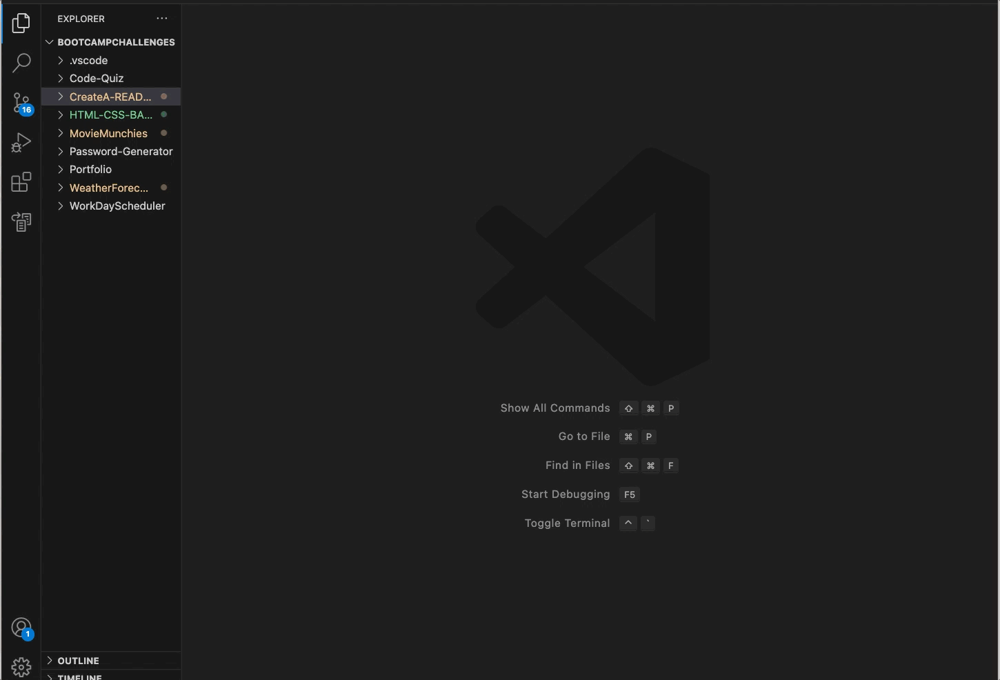

# README Generator

   

## Description
Creates a README file for a given project

## Table of Contents
 * [Usage](#Usage),
 * [Licenses](#Licenses),
 * [Contributions](#Contributions),
 * [Tests](#tests) 

## Installation
- Create a repository for the files 
- Clone the repository on your local server 
- Make sure you have NODEjs installed and then install inquirer 
- run node index in integrated terminal 
- Answer prompt questions 

## Usage
None

## License
APACHE 2.0 License: Conditional Open Source

## Contributions 
Not accepting contributions at this time.

## Tests 
None

## Walkthrough Videos

  

## Questions
Links to my email, GitHub, and LinkedIn have been included for any questions regarding my app. 

  

   
